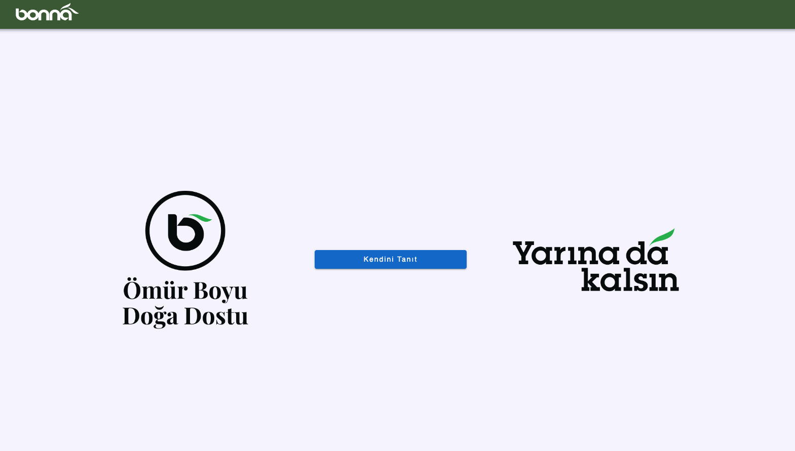
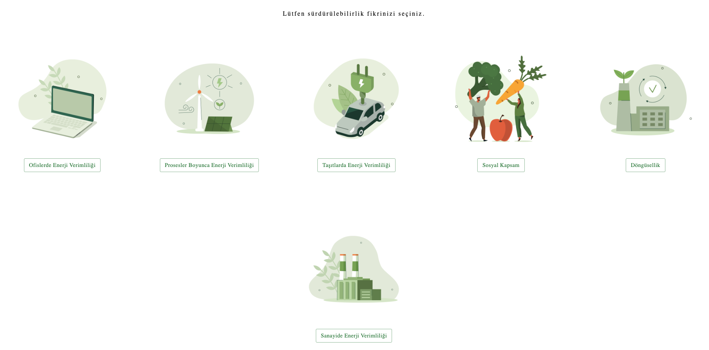
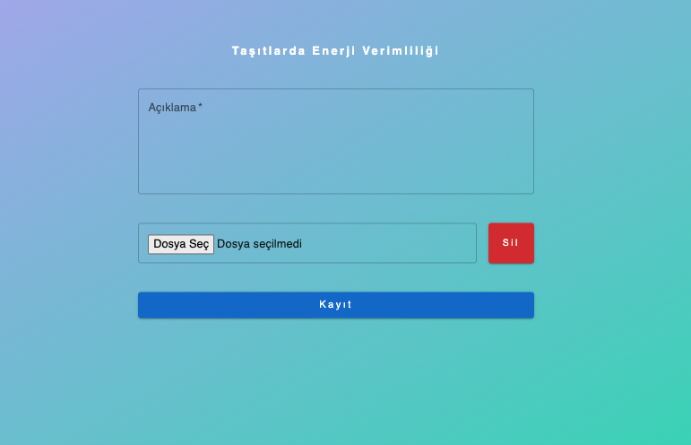

# Sustainability

#### About Project : 
##### The application was created to get ideas from users on sustainability.
##### After the user enters the information that identifies him/her, he/she accesses the sustainability options page.
##### The user explains the idea of sustainability in detail.
##### It can upload files.
##### Access to the platform is done via QR code or URL address.
##### On the reporting page, the data that users have selected and shared their opinions are reported in graphic and table formats.
##### Firebase database was used in the application.
##### The reporting page is accessed through the Authentication process.


## Installation

Install Sustainability

```bash
  npm install Sustainability
  cd Sustainability/current_version folder
  npm install node_modules
  npm start or yarn start or pnpm dev&start
```


## Images



